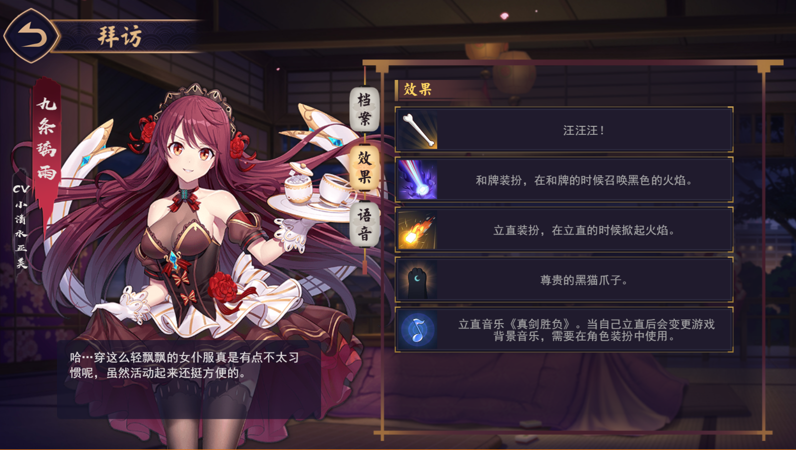

# 一个雀魂魔改mod,解锁全部人物，道具等

>2019.3.28更新，添加八木唯结婚效果<br/>
2019.4.5更新，修复单角色语音大小不能调节的bug<br/>
2019.4.6更新，修复报菜名时语音大小与角色不匹配的bug<br/>
2019.4.27更新，版本更新0.5.3,修bug,角色切换界面有小bug,明天再弄<br/>
2019.5.29更新,版本更新0.5.81,修复牌谱打开卡死bug<br/>
2019.6.1更新,版本更新0.5.104,新增大小姐和占卜师两个角色，修复角色切换界面bug<br/>
2019.6.6更新,版本更新0.5.112,日常更新<br/>
2019.7.18更新,版本更新0.5.158,更新三个新角色，同时加入记忆雀士功能，不用手动改代码了。（ps:因此在使用雀魂PLUS时要求权限）<br/>
2019.7.19更新,版本更新0.5.158,其实更了四个角色，忘了233，修复对战中不能看到对手资料的bug<br/>
2019.8.17更新，版本更新0.6.15,你们要的泳装和新角色来了。没做测试，可能有bug

>注意：解锁人物仅在本地有效，别人还是只能看到你原来的角色。<br/>
魔改千万条，安全第一条。<br/>
使用不规范，账号两行泪。

>本插件仅供学习参考交流，请使用者于下载24小时内自行删除，不得用于商业用途，否则后果自负。
## 效果
 
 

## 使用方法：

 - 方法一（推荐）

    使用雀魂PLUS。请先下载雀魂PLUS， [下载地址](https://github.com/MajsoulPlus/majsoul-plus/releases)。在**插件界面**（十分重要！十分重要！十分重要！）将**我全都要-UsernameFull.mspe**导入即可。

 - 方法二（不推荐，需node，较麻烦）

    参考 [雀魂立绘魔改](https://github.com/aoarashi1988/majsoul_custom_charactor)，替换掉**UI_Sushe.js**

 - 方法三（推荐）

    使用油猴脚本，即tampermonkey，下载和使用方法自行百度。在油猴里导入**雀魂mod.user.js**即可。
    或者使用[greasyfork](https://greasyfork.org/zh-CN/scripts/378201-%E9%9B%80%E9%AD%82mod)
    
在这里参考了 [baka-levey的代码](https://github.com/baka-levey/majsoul_test)。特此感谢。

## 其他
如需更换初始人物和道具等，修改文件开头`setcharacter`,`setitemlizhibang`等值即可。

对应表

|id|道具|
|--|--|
|id:305001| name_chs:"咸鱼立直棒"|
|id: 305002| name_chs: "大葱立直棒"|
|id: 305003| name_chs: "狗骨头立直棒"
|id: 305004| name_chs: "巧克力立直棒"|
|id: 305005| name_chs: "邪眼立直棒"|
|id: 305006| name_chs: "翡翠立直棒"|
|id: 305018| name_chs: "猩红立直棒"|
|id: 305019| name_chs: "24K金棒"|
|id: 305027| name_chs: "爆竹立直棒"|
|id: 305028| name_chs: "饺子立直棒"|
|id: 305007| name_chs: "烈焰和牌"|
|id: 305008| name_chs: "旋风和牌"|
|id: 305009| name_chs: "樱花和牌"|
|id: 305023| name_chs: "黑炎和牌"|
|id: 305029| name_chs: "烟花和牌"|
|id: 305034| name_chs: "和牌-爆炎龙卷"|
|id: 305035| name_chs: "和牌-方舟反应堆"|
|id: 305036| name_chs: "和牌-红玫瑰"|
|id: 305010| name_chs: "苍火立直"|
|id: 305021| name_chs: "碎冰立直"|
|id: 305022| name_chs: "火焰立直"|
|id: 305032| name_chs: "立直-幻影"|
|id: 305033| name_chs: "立直-飞羽"|
|id: 305011| name_chs: "橘猫爪"|
|id: 305030| name_chs: "夜月猫爪"|
|id: 305031| name_chs: "蓝猫爪"|
|id: 305025| name_chs: "《真剑胜负》"|
|id: 305026| name_chs: "《激斗》"|


##### 本修改程序遵循 WTFPL 协议
```
            DO WHAT THE FUCK YOU WANT TO PUBLIC LICENSE
                    Version 2, December 2004

 Copyright (C) 2004 Sam Hocevar <sam@hocevar.net>

 Everyone is permitted to copy and distribute verbatim or modified
 copies of this license document, and changing it is allowed as long
 as the name is changed.

            DO WHAT THE FUCK YOU WANT TO PUBLIC LICENSE
   TERMS AND CONDITIONS FOR COPYING, DISTRIBUTION AND MODIFICATION

  1. You just DO WHAT THE FUCK YOU WANT TO.

```
